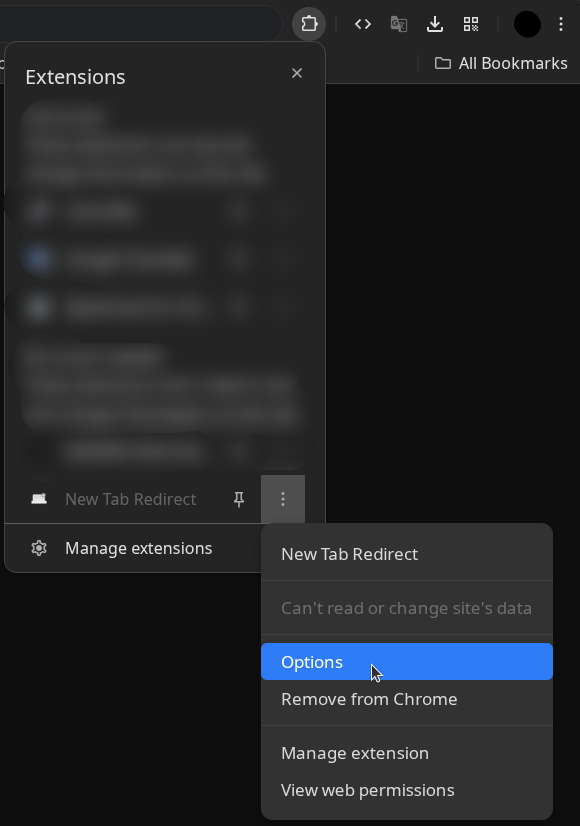

# [Домашняя страница для Google Chrome](https://goldextremal.github.io/homepage/)

Кастомная стартовая страница в стиле Chrome New Tab: поиск, шорткаты, виджеты и меню сервисов.


## Настройка в Chrome

1. Откройте страницу настроек внешнего вида: `chrome://settings/appearance` и активируйте переключатель `Show home button` (Показать кнопку «Главная»).
2. В поле назначения вместо новой страницы вставьте ссылку: `https://goldextremal.github.io/homepage/`.
3. Установите расширение для редиректа новой вкладки: `https://chromewebstore.google.com/detail/new-tab-redirect/icpgjfneehieebagbmdbhnlpiopdcmna`.
4. Если перенаправление не сработало автоматически, откройте настройки расширения, вставьте ссылку `https://goldextremal.github.io/homepage/` и нажмите `Save`.

<p align="center">
  
</p>

## Стек

- HTML + CSS + JavaScript (без сборки)
- ES Modules
- `localStorage` для пользовательских данных

## Локальный запуск

1. Откройте терминал в корне проекта.
2. Запустите локальный HTTP-сервер:

```bash
python3 -m http.server 8080
```

3. Откройте в браузере: `http://localhost:8080`.
4. Для остановки сервера нажмите `Ctrl + C` в терминале.

Примечание: не открывайте `index.html` напрямую как `file://...`, часть функций (API-запросы и загрузка ассетов) может работать некорректно.

## Структура проекта

```text
.
├── assets/
│   ├── preview.png
│   ├── extentions.png
│   └── icons/
│       ├── chrome-icon.ico
│       ├── gmail-icon.svg
│       └── flags/
│           └── *.svg
├── src/
│   ├── js/
│   │   ├── config/
│   │   │   └── constants.js
│   │   ├── features/
│   │   │   ├── appsMenu.js
│   │   │   ├── googleServicesMenu.js
│   │   │   ├── search.js
│   │   │   ├── settings.js
│   │   │   ├── shortcuts.js
│   │   │   └── widgets.js
│   │   ├── utils/
│   │   │   ├── log.js
│   │   │   ├── reorder.js
│   │   │   └── url.js
│   │   └── main.js
│   └── styles/
│       ├── main.css
│       ├── base/
│       │   └── index.css
│       ├── components/
│       │   └── index.css
│       ├── layout/
│       │   └── index.css
│       └── widgets/
│           └── index.css
├── index.html
└── README.md
```

## Модули и ответственность

- `src/js/main.js`
  Инициализирует все фичи, связывает глобальные обработчики клика/Escape.
- `src/js/features/search.js`
  Поиск, подсказки Google Suggest (JSONP), локальная история запросов.
- `src/js/features/shortcuts.js`
  CRUD шорткатов, лимит на количество, drag-and-drop перестановка, определение favicon.
- `src/js/features/widgets.js`
  Погода, валюты, IP/регион, drag-and-drop перестановка виджетов.
  Данные виджетов загружаются лениво и только когда виджеты видимы.
- `src/js/features/settings.js`
  Меню настроек, управление видимостью блоков, действия очистки/сброса данных.
  Публикует событие `page-settings:widgets-visibility`.
- `src/js/features/appsMenu.js`
  Открытие/закрытие меню сервисов; ленивый рендер содержимого при первом открытии.
- `src/js/features/googleServicesMenu.js`
  Модель и рендер меню сервисов Google (заголовок, сетка сервисов, кнопка).

### Утилиты

- `src/js/utils/url.js` — нормализация URL и доменные эвристики.
- `src/js/utils/reorder.js` — общая логика анимации/перестановки для DnD.
- `src/js/utils/log.js` — единый мягкий лог ошибок в консоль.

### Стили

- `src/styles/main.css` — точка входа стилей (`@import` слоёв).
- `src/styles/base/index.css` — CSS-переменные, базовые reset и фон.
- `src/styles/layout/index.css` — topbar, меню, layout секций.
- `src/styles/components/index.css` — поиск, шорткаты, модальные элементы.
- `src/styles/widgets/index.css` — карточки и адаптив виджетов.

## localStorage

- `chrome-clone-shortcuts-v1` — пользовательские шорткаты.
- `chrome-clone-weather-city-v1` — последний выбранный город погоды.
- `chrome-clone-widgets-order-v1` — порядок виджетов.
- `chrome-clone-search-history-v1` — локальная история поиска.
- `chrome-clone-page-settings-v1` — настройки показа шорткатов/виджетов.
