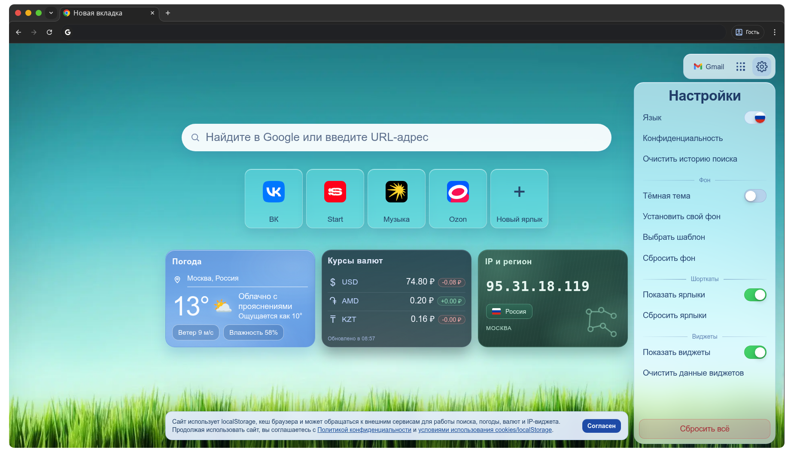
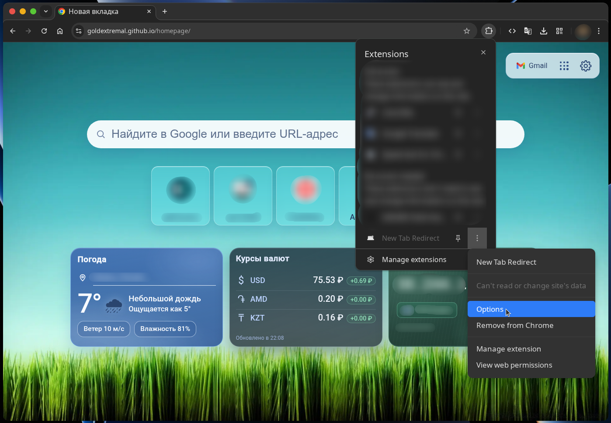

# [Домашняя страница Chrome](https://goldextremal.github.io/homepage/)

Кастомная стартовая страница в стиле Chrome New Tab: поиск, шорткаты, виджеты, меню сервисов Google, темы и шаблоны фона.



## Возможности

- Поиск с Google Suggest + локальная история запросов.
- Шорткаты: добавление, редактирование, удаление, drag-and-drop перестановка.
- Лимит шорткатов: до 5 карточек.
- Виджеты: погода, курсы валют, IP/регион.
- Переключение языка интерфейса: русский/английский.
- Локализация погодного виджета и города в IP-виджете под выбранный язык.
- Перестановка виджетов drag-and-drop.
- Тёмная/светлая тема через `Dark mode`.
- Кастомный фон из файла.
- Меню `Choose a template` с готовыми шаблонами.
- Меню сервисов Google (кнопка из 9 точек).
- Управление пользовательскими данными из меню `Settings`:
  - `Clear search history`
  - `Reset shortcuts`
  - `Clear widgets data`
  - `Reset background`
  - `Reset all user data`

## Настройка в Chrome

Ниже очень простой вариант, шаг за шагом.

1. Откройте Chrome.
2. Скопируйте и вставьте в адресную строку:
   `chrome://settings/appearance`
3. Нажмите `Enter`.
4. Найдите пункт `Show home button` (или «Показывать кнопку "Главная"») и включите его.
5. В поле для адреса домашней страницы вставьте:
   `https://goldextremal.github.io/homepage/`
6. Теперь установите расширение `New Tab Redirect`. Для этого откройте ссылку:
   `https://chromewebstore.google.com/detail/new-tab-redirect/icpgjfneehieebagbmdbhnlpiopdcmna`
7. Нажмите кнопку установки (`Add to Chrome` / «Установить» / «Добавить в Chrome»).
8. Откройте новую вкладку (`Ctrl + T`), чтобы проверить результат.
9. Если открылась не наша страница:
   - откройте настройки расширения `New Tab Redirect`;
   - вставьте туда адрес `https://goldextremal.github.io/homepage/`;
   - нажмите `Save`;
   - снова откройте новую вкладку (`Ctrl + T`).

Готово: теперь новая вкладка в Chrome должна открывать эту домашнюю страницу.

<p align="center">
  
</p>

## Локальный запуск

1. Откройте терминал в корне проекта.
2. Запустите локальный сервер:

```bash
python3 -m http.server 8080
```

3. Откройте в браузере `http://localhost:8080`.
4. Для остановки сервера нажмите `Ctrl + C`.

Важно: не запускайте через `file://...` (часть API/ассетов работает некорректно без HTTP-сервера).

## Стек

- HTML + CSS + JavaScript (ES Modules, без фреймворков)
- `localStorage` для пользовательских данных
- Service Worker для кеша статики

## Структура проекта

```text
.
├── assets/
│   ├── preview.png
│   ├── extentions2.png
│   ├── templates/
│   │   ├── full/
│   │   └── thumb/
│   └── icons/
│       ├── chrome-icon.ico
│       ├── gmail-icon.svg
│       └── flags/
├── src/
│   ├── js/
│   │   ├── config/
│   │   ├── features/
│   │   ├── utils/
│   │   └── main.js
│   └── styles/
│       ├── base/
│       ├── components/
│       ├── deferred.css
│       ├── layout/
│       ├── widgets/
│       └── main.css
├── sw.js
├── index.html
└── README.md
```

## Настройки и данные

Все пользовательские настройки сохраняются в `localStorage`, поэтому после перезагрузки страницы состояние остаётся таким же.

### Что хранится

`chrome-clone-page-settings-v1`
- Общие настройки страницы:
- язык интерфейса;
- тема (`dark`/`light`);
- видимость шорткатов;
- видимость виджетов.

`chrome-clone-shortcuts-v1`
- Массив пользовательских шорткатов (название, URL, иконка).
- Лимит: 5 карточек.

`chrome-clone-search-history-v1`
- Локальная история поисковых запросов, которая используется в подсказках.

`chrome-clone-weather-city-v1`
- Последний выбранный город для погодного виджета.

`chrome-clone-widgets-order-v1`
- Порядок карточек виджетов после drag-and-drop перестановки.

`chrome-clone-background-image-v1`
- Кастомный фон (data URL или путь к шаблону).

`chrome-clone-background-template-v1`
- Идентификатор выбранного шаблона фона.

Кеши данных виджетов
- Погода, валюты и IP кешируются с TTL, чтобы ускорить повторную загрузку страницы и уменьшить количество API-запросов.

### Действия в Settings

`Clear search history`
- Очищает только локальную историю поиска (`chrome-clone-search-history-v1`).

`Reset shortcuts`
- Удаляет пользовательские шорткаты (`chrome-clone-shortcuts-v1`) и возвращает набор по умолчанию.

`Clear widgets data`
- Сбрасывает город погоды и порядок виджетов (`chrome-clone-weather-city-v1`, `chrome-clone-widgets-order-v1`).

`Reset background`
- Сбрасывает фон к дефолтной тёмной теме и очищает фоновые ключи (`chrome-clone-background-image-v1`, `chrome-clone-background-template-v1`).

`Reset all user data`
- Полный сброс всех пользовательских данных страницы.
- После очистки выполняется перезагрузка, и страница возвращается к начальному состоянию.
